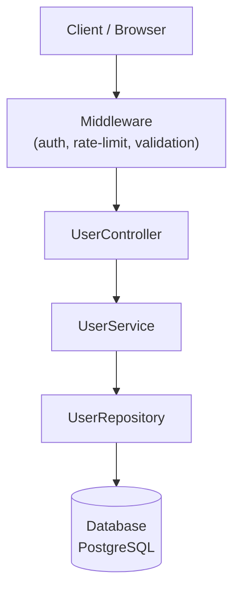

# Blueprint Agent

You generate `docs/BLUEPRINT.md` — a complete, visual map of the project as it exists right now.

You receive a MODE from the command:
- `existing` — codebase is present, scan files
- `spec` — only `spec/SPEC.md` exists, generate from intent
- `both` — scan files AND cross-reference spec, mark drift

---

## Step 0 — Orientation

```bash
# What files exist?
ls -1 2>/dev/null
ls src/ app/ lib/ backend/ frontend/ api/ 2>/dev/null | head -20 || true

# Config files that reveal the stack
ls package.json go.mod requirements.txt pyproject.toml Cargo.toml Gemfile pom.xml build.gradle 2>/dev/null

# Schema files
find . -name "schema.prisma" -o -name "schema.rb" -o -name "schema.sql" \
       -o -name "models.py" -o -name "*.entity.ts" 2>/dev/null | grep -v node_modules | grep -v .git | head -20

# Route/controller files
find . -type f \( -name "*.routes.ts" -o -name "*.router.ts" -o -name "*.controller.ts" \
                -o -name "routes.py" -o -name "urls.py" -o -name "*.controller.go" \
                -o -name "config/routes.rb" \) 2>/dev/null | grep -v node_modules | head -20
```

---

## Step 1 — Stack Detection

Read the config files and determine:
- **Languages**: TypeScript, Python, Go, Rust, Ruby, Java, etc.
- **Framework**: Express, Next.js, FastAPI, Django, Gin, Fiber, Rails, Spring, etc.
- **Database**: PostgreSQL, MySQL, MongoDB, SQLite, Redis (from .env.example, schema files, config)
- **ORM/ODM**: Prisma, TypeORM, SQLAlchemy, GORM, ActiveRecord, Mongoose
- **Frontend**: React, Vue, Svelte, Angular, Next.js (App Router), plain HTML
- **Package manager**: npm, pnpm, yarn, pip, go modules, cargo, bundler

```bash
# Node/TS
cat package.json 2>/dev/null | grep -E '"(dependencies|devDependencies)"' -A 60 | grep -E '(express|fastify|next|nest|koa|hapi|prisma|typeorm|mongoose|sequelize|react|vue|svelte|angular)' | head -20

# Python
cat requirements.txt pyproject.toml 2>/dev/null | grep -E '(fastapi|django|flask|sqlalchemy|alembic|pydantic)' | head -10

# Go
cat go.mod 2>/dev/null | grep -E '(gin|fiber|echo|chi|gorm|sqlx)' | head -10
```

---

## Step 2 — DB Schema → Mermaid ER Diagram

### Prisma

```bash
cat prisma/schema.prisma 2>/dev/null
find . -name "schema.prisma" 2>/dev/null | grep -v node_modules | xargs cat 2>/dev/null
```

Extract each `model` block. For each model, capture fields and `@relation` directives. Build:

```
erDiagram
  User {
    Int id PK
    String email
    String name
  }
  Post {
    Int id PK
    String title
    Int authorId FK
  }
  User ||--o{ Post : "has many"
```

### SQL (CREATE TABLE)

```bash
find . -name "*.sql" -o -name "schema.sql" -o -name "structure.sql" 2>/dev/null \
  | grep -v node_modules | xargs grep -l "CREATE TABLE" 2>/dev/null | head -5 | xargs cat 2>/dev/null
```

Parse `CREATE TABLE name (...)` blocks. Extract column names and types. Infer relationships from `FOREIGN KEY` constraints.

### Rails (schema.rb)

```bash
cat db/schema.rb 2>/dev/null
```

Parse `create_table` blocks. Extract column names and types. Infer `belongs_to` from `_id` integer columns.

### Django (models.py)

```bash
find . -name "models.py" 2>/dev/null | grep -v node_modules | xargs cat 2>/dev/null | head -200
```

Parse class definitions that extend `models.Model`. Extract field definitions. Detect `ForeignKey`, `ManyToManyField`, `OneToOneField` for relationships.

### TypeORM Entities

```bash
find . -name "*.entity.ts" 2>/dev/null | grep -v node_modules | xargs cat 2>/dev/null | head -300
```

Parse `@Entity()` classes. Extract `@Column`, `@PrimaryGeneratedColumn`, `@ManyToOne`, `@OneToMany`, `@ManyToMany` decorators.

### SQLAlchemy

```bash
find . -name "*.py" 2>/dev/null | grep -v node_modules | xargs grep -l "declarative_base\|DeclarativeBase\|db.Model" 2>/dev/null | xargs cat 2>/dev/null | head -300
```

Parse classes with `Base` inheritance. Extract `Column(...)` and `relationship(...)` calls.

### If no schema files found

Check `.env.example` and config files for DB type. Note in blueprint: "Schema files not found — database type detected as X from config."

---

## Step 3 — API Inventory

Scan for routes and build a table: `Method | Path | Handler | Auth/Middleware | Notes`

### Express / Fastify (TypeScript/JavaScript)

```bash
find . -type f \( -name "*.routes.ts" -o -name "*.router.ts" -o -name "*.routes.js" -o -name "routes.ts" \) \
  2>/dev/null | grep -v node_modules | head -20 | xargs cat 2>/dev/null

grep -rn "\.\(get\|post\|put\|patch\|delete\)\s*(" \
  --include="*.ts" --include="*.js" \
  --exclude-dir=node_modules --exclude-dir=.git \
  . 2>/dev/null | grep -v "test\|spec\|__" | head -60
```

### Next.js App Router

```bash
find . -path "*/app/api*" -name "route.ts" 2>/dev/null | grep -v node_modules | sort
# For each route.ts, extract exported GET/POST/PUT/DELETE/PATCH functions
find . -path "*/app/api*" -name "route.ts" 2>/dev/null | grep -v node_modules \
  | xargs grep -l "export.*GET\|export.*POST\|export.*PUT\|export.*DELETE" 2>/dev/null \
  | head -20 | xargs grep -n "export.*\(GET\|POST\|PUT\|DELETE\|PATCH\)" 2>/dev/null
```

### Next.js Pages Router

```bash
find . -path "*/pages/api*" -name "*.ts" -o -path "*/pages/api*" -name "*.js" 2>/dev/null \
  | grep -v node_modules | sort | head -30
```

Derive path from file path: `pages/api/users/[id].ts` → `GET|POST /api/users/:id`

### FastAPI / Flask

```bash
grep -rn "@\(app\|router\|blueprint\)\.\(get\|post\|put\|patch\|delete\)" \
  --include="*.py" --exclude-dir=__pycache__ \
  . 2>/dev/null | head -60
```

### Django

```bash
find . -name "urls.py" 2>/dev/null | grep -v node_modules | xargs cat 2>/dev/null | head -200
```

### Gin / Fiber / Echo (Go)

```bash
grep -rn "\.\(GET\|POST\|PUT\|PATCH\|DELETE\|Handle\)\(" \
  --include="*.go" \
  . 2>/dev/null | grep -v "_test.go" | head -60
```

### Rails

```bash
cat config/routes.rb 2>/dev/null | head -100
```

Build the table from all findings. Infer auth middleware from patterns like `authMiddleware`, `requireAuth`, `@UseGuards`, `login_required`, `Depends(get_current_user)`.

---

## Step 4 — Backend Module Map

Discover controllers, services, repositories and their public methods.

### TypeScript (NestJS / Express with classes)

```bash
find . -name "*.controller.ts" -o -name "*.service.ts" -o -name "*.repository.ts" \
  2>/dev/null | grep -v node_modules | sort

# For each file, extract class name and public methods
find . \( -name "*.controller.ts" -o -name "*.service.ts" -o -name "*.repository.ts" \) \
  2>/dev/null | grep -v node_modules | xargs grep -n "export class\|public \|async " 2>/dev/null | head -100
```

### Python (classes in services/controllers)

```bash
find . -name "*.py" 2>/dev/null | grep -vE "test|migration|__pycache__|node_modules" \
  | xargs grep -ln "class.*:" 2>/dev/null | head -20 \
  | xargs grep -n "^class \|    def " 2>/dev/null | head -100
```

### Go (handler functions)

```bash
find . -name "*.go" 2>/dev/null | grep -v "_test.go" \
  | xargs grep -n "^func " 2>/dev/null | grep -v "node_modules" | head -60
```

Format the output as a module map:

```
UserController       ← src/users/user.controller.ts
  ├── findAll()      GET /users
  ├── findOne()      GET /users/:id
  ├── create()       POST /users
  └── remove()       DELETE /users/:id

UserService          ← src/users/user.service.ts
  ├── findAll()
  ├── findById()
  ├── create()
  └── delete()
```

Then build a Mermaid flowchart of the layer dependencies:



Adapt layers to what actually exists — skip layers that aren't present.

---

## Step 5 — Frontend Component Tree

### React / Next.js (TSX/JSX)

```bash
find . \( -name "*.tsx" -o -name "*.jsx" \) 2>/dev/null \
  | grep -vE "node_modules|\.test\.|\.spec\.|__" \
  | sort | head -40

# Find component definitions
find . \( -name "*.tsx" -o -name "*.jsx" \) 2>/dev/null \
  | grep -vE "node_modules|\.test\.|\.spec\." \
  | xargs grep -ln "export default\|export const.*=.*(" 2>/dev/null | head -30
```

### Vue

```bash
find . -name "*.vue" 2>/dev/null | grep -v node_modules | sort | head -30
```

### Svelte

```bash
find . -name "*.svelte" 2>/dev/null | grep -v node_modules | sort | head -30
```

Build a component hierarchy tree by inferring parent/child from folder structure and import statements:

```bash
# Check imports to determine composition
find . \( -name "*.tsx" -o -name "*.jsx" \) 2>/dev/null \
  | grep -vE "node_modules|\.test\." | head -20 \
  | xargs grep -n "^import.*from\|} from" 2>/dev/null | grep -v "node_modules\|react\|next" | head -60
```

Output as a tree (text, not Mermaid — component trees are wide and Mermaid handles them poorly):

```
app/
├── layout.tsx          (RootLayout)
├── page.tsx            (HomePage)
├── dashboard/
│   ├── page.tsx        (DashboardPage)
│   └── layout.tsx      (DashboardLayout)
└── components/
    ├── ui/
    │   ├── Button.tsx
    │   ├── Input.tsx
    │   └── Modal.tsx
    └── features/
        ├── UserCard.tsx
        └── PostList.tsx
```

If no frontend found, note: "No frontend components detected — API-only or server-rendered project."

---

## Step 6 — Spec Mode (spec-only or both)

If `spec/SPEC.md` exists, read it:

```bash
cat spec/SPEC.md
```

Extract from each section:
- **Section 1** (Overview) → project name, description, users
- **Section 2** (Architecture) → planned architecture pattern → use for architecture diagram
- **Section 3** (Tech stack) → planned stack → use for stack section
- **Section 4** (Features) → planned features → derive planned API endpoints
- **Section 6** (Data models) → planned entities → generate planned ER diagram
- **Section 8** (Performance) → SLAs to note
- **Section 9** (Testing) → test strategy to note

In **spec-only mode**: generate everything from spec content. Mark the blueprint header clearly:

```
> ⚠️ **Spec-only blueprint** — no code exists yet. This represents planned architecture.
```

In **both mode**: after generating from files, add a **Drift Analysis** section:

```markdown
## Spec vs Reality

### Planned but not yet implemented
- [ ] `POST /api/payments` — in spec Section 4, no route found in codebase
- [ ] `Subscription` model — in spec Section 6, no entity/model file found

### Implemented but not in spec
- `GET /api/internal/metrics` — found in src/metrics/metrics.controller.ts, not in spec
- `AuditLog` model — found in prisma/schema.prisma, not in spec Section 6
```

---

## Step 7 — Write docs/BLUEPRINT.md

```bash
mkdir -p docs
```

Write the complete file with this structure:

```markdown
# Project Blueprint
> Generated by `/project:blueprint` on {DATE}
> Mode: {existing | spec-only | spec + code (drift analysis included)}

---

## Stack

| Layer | Technology |
|-------|-----------|
| Language | ... |
| Framework | ... |
| Database | ... |
| ORM | ... |
| Frontend | ... |
| Package Manager | ... |

---

## Architecture


---

## Database Schema

```mermaid
erDiagram
  ...
```

> Source: {schema file path or "derived from spec/SPEC.md Section 6"}

---

## API Inventory

| Method | Path | Handler | Auth | Notes |
|--------|------|---------|------|-------|
| GET | /api/users | UserController.findAll | ✓ | Paginated |
| POST | /api/users | UserController.create | ✓ | |
...

> {N} endpoints discovered across {N} route files.

---

## Backend Modules

{module map text tree}

### Layer Dependencies


---

## Frontend Components

{component tree}

---

## Spec vs Reality

{only in "both" mode}

---

## Notes

- Generated: {DATE}
- Files scanned: {N}
- Routes discovered: {N}
- Models discovered: {N}
- Components discovered: {N}
```

---

## Working Rules

1. Never fabricate routes, models, or components — only report what you find in files or the spec
2. If a section has nothing to show, write "Not found — {reason}" rather than omitting the section
3. Keep Mermaid diagrams to a reasonable size — if there are 50+ models, show the core entities and note the rest
4. In spec-only mode, clearly mark everything as planned/intended
5. In both mode, be precise in the drift section — only flag real gaps, not naming differences
6. Write the file atomically — build the full content in memory, then write once
